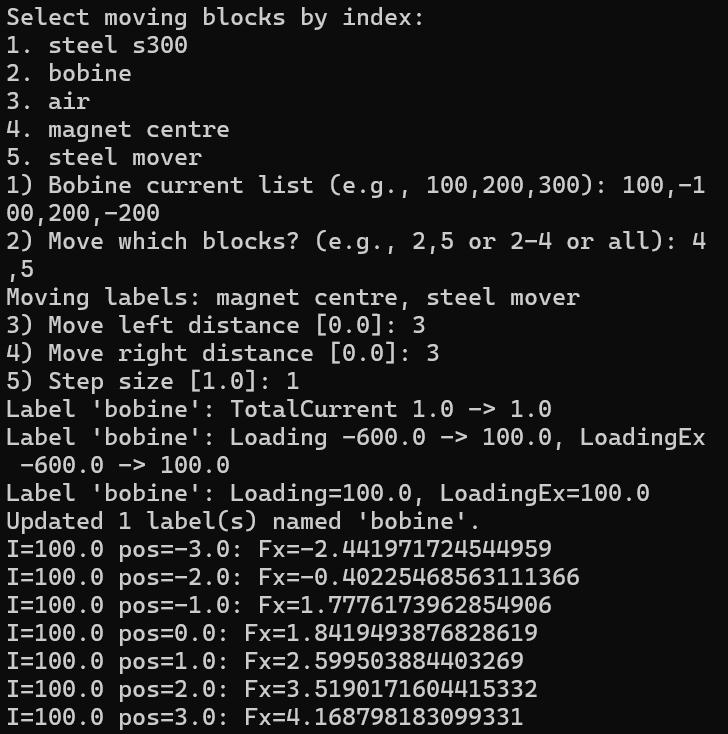

# Versions

## V1 (core features)
1. Connect to QuickField via Python (COM)
2. Modify label values
3. Modify geometry for continuous motion
4. Build mesh and read post-solve data

## V2 (engineered layout)
1. Split functionality into 4 modules for maintainability
2. Simplified duplicate logic (shared open/load helpers)

## V3 (interactive batch workflow)
1. Auto read current model block labels
2. Prompt user for current list, moving labels, and displacement range
3. Output electromagnetic force table (CSV)

## V4 (GUI workflow)
1. Added desktop UI for label selection and batch run
2. Multi-select outputs and moving labels
3. Built-in CSV preview window for results

## V5
1. Fixed an issue where one label could not reliably control multiple moving parts at the same time.
2. Fixed an issue where QuickField could close unexpectedly after CSV generation completed.

## Script mapping
- Entry point: `src/main.py` (CLI)
- Connect to QuickField: `src/QF_auto/connection.py`
- Modify label values: `src/QF_auto/labels.py`
- Modify geometry: `src/QF_auto/geometry.py`
- Mesh + read results: `src/QF_auto/solve.py`
- Interactive sweep: `src/QF_auto/workflow.py`
